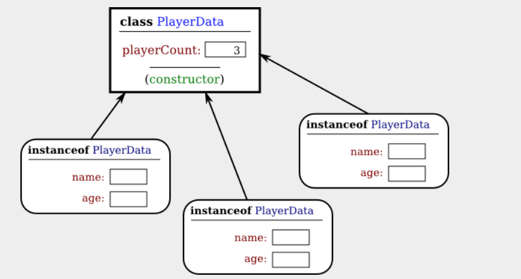
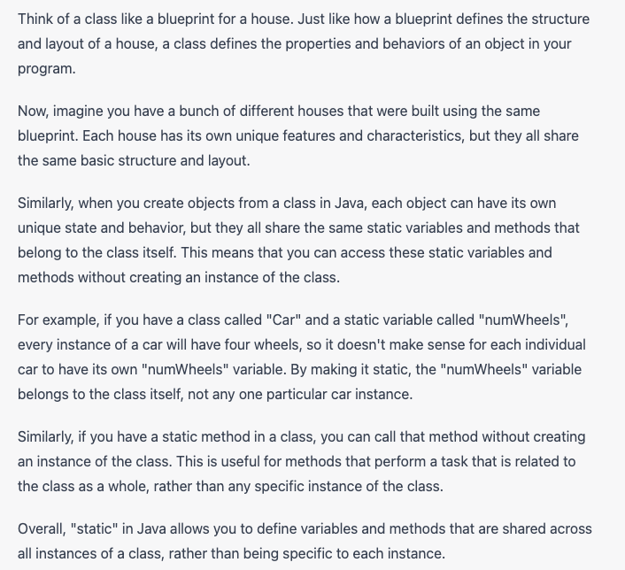
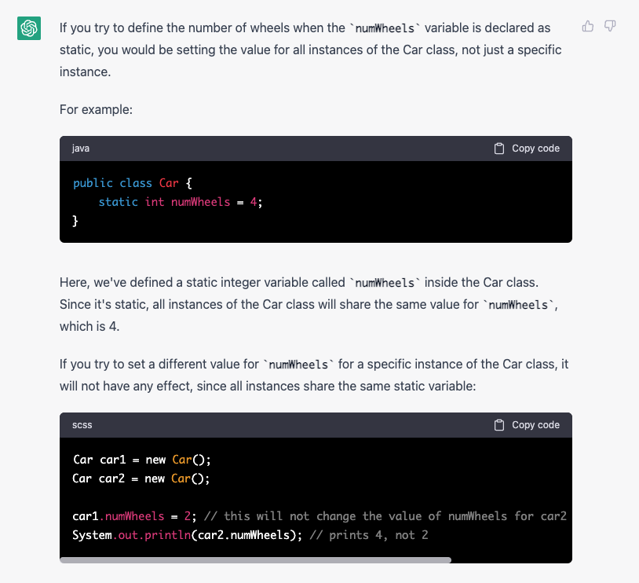
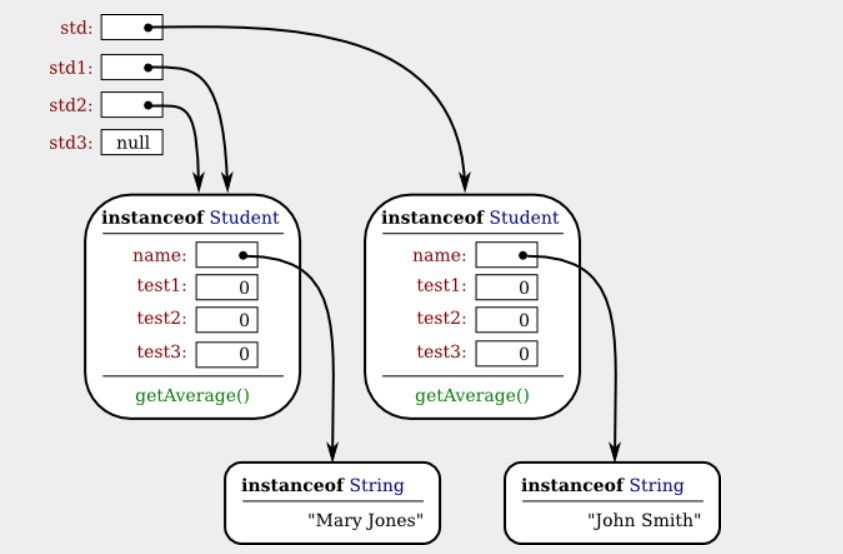
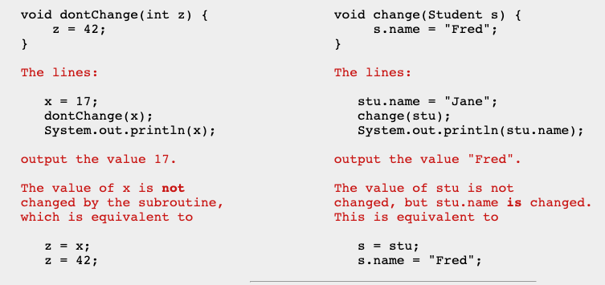

# Section 5.1

OBJECT-ORIENTED PROGRAMMING (OOP) represents an attempt to make programs more closely model the way people think about and deal with the world.

To some extent, OOP is just a change in point of view. We can think of an object in standard programming terms as nothing more than a set of variables together with some subroutines for manipulating those variables

As I have mentioned before, in the context of object-oriented programming, subroutines are often referred to as methods.

From the point of view of programming, it is more exact to say that classes are used to create objects. A class is a kind of factory—or blueprint—for constructing objects. The non-static parts of the class specify, or describe, what variables and methods the objects will contain

```
class UserData {
    static String name;
    static int age;
}
```


- There is no such variable as PlayerData.name or PlayerData.age, since non-static variables do not become part of the class itself. 
- PlayerData class can be used to create objects. There can be many objects created using the class, and each one will have its own variables called name and age. 
- This is what it means for the non-static parts of the class to be a template for objects: Every object gets its own copy of the non-static part of the class. We can visualize the situation in the computer's memory after several objects have been created like this:

**every object contains a name and an age. An object that is created from a class is called an *instance* of that class, and as the picture shows, every object "knows" which class was used to create it.**
- An object that is created using a class is said to be an instance of that class. We will sometimes say that the object belongs to the class. The variables that the object contains are called instance variables. The methods (that is, subroutines) that the object contains are called instance methods

```
public class Student {

   public String name;  // Student's name.
   public double test1, test2, test3;   // Grades on three tests.
   
   public double getAverage() {  // compute average test grade
      return (test1 + test2 + test3) / 3;
   }
   
}  // end of class Student
```

What is static in class and what happens when you try to define value to a static class variable



<br>
 <red>In Java, no variable can ever hold an object.
A variable can only hold a reference to an object. </red>

- Instead of holding an object itself, a variable holds the information necessary to find the object in memory. This information is called a reference or pointer to the object. In effect, a reference to an object is the address of the memory location where the object is stored. 
  - ```std = new Student();```   

```
Student std, std1,       // Declare four variables of
          std2, std3;    //   type Student.

std = new Student();     // Create a new object belonging
                         //   to the class Student, and
                         //   store a reference to that
                         //   object in the variable std.

std1 = new Student();    // Create a second Student object
                         //   and store a reference to
                         //   it in the variable std1.

std2 = std1;             // Copy the reference value in std1
                         //   into the variable std2.

std3 = null;             // Store a null reference in the
                         //   variable std3.
                         
std.name = "John Smith";  // Set values of some instance variables.
std1.name = "Mary Jones";

     // (Other instance variables have default
     //    initial values of zero.)
```


- In this picture, when a variable contains a reference to an object, the value of that variable is shown as an arrow pointing to the object. Note, by the way, that the Strings are objects! The variable std3, with a value of null, doesn't point anywhere. The arrows from std1 and std2 both point to the same object. This illustrates a Very Important Point:

```
When one object variable is assigned
to another, only a reference is copied.
The object referred to is not copied.
```

When you make a test "if (std1 == std2)", you are testing whether the values stored in std1 and std2 are the same. But the values that you are comparing are references to objects; they are not objects. So, you are testing whether std1 and std2 refer to the same object.




to find out what its value is by providing a public accessor method that returns the value of the variable. 

```
public String getTitle() {
    return title;
}
```

By convention, the name of an accessor method for a variable is obtained by capitalizing the name of variable and adding "get" in front of the name. 


You might also want to allow "write access" to a private variable. That is, you might want to make it possible for other classes to specify a new value for the variable. 

```
public void setTitle( String newTitle ) {
   title = newTitle;
}
```

you might wonder why not just make the variable public? The reason is that getters and setters are not restricted to simply reading and writing the variable's value. 

a getter method might keep track of the number of times that the variable has been accessed:
```
public String getTitle() {
    titleAccessCount++;  // Increment member variable titleAccessCount.
    return title;
}
```

and a setter method might check that the value that is being assigned to the variable is legal:

```
public void setTitle( String newTitle ) {
   if ( newTitle == null )   // Don't allow null strings as titles!
      title = "(Untitled)";  // Use an appropriate default value instead.
   else
      title = newTitle;
}
```

 If you've used a getter and setter from the beginning, you can make the modification to your class without affecting any of the classes that use your class. 

# Section 5.2

Unlike other subroutines, a constructor can only be called using the new operator, in an expression that has the form

`new class-name ( parameter-list )`

A constructor call is more complicated than an ordinary subroutine or function call. It is helpful to understand the exact steps that the computer goes through to execute a constructor call:

- First, the computer gets a block of unused memory in the heap, large enough to hold an object of the specified type.
- It initializes the instance variables of the object. If the declaration of an instance variable specifies an initial value, then that value is computed and stored in the instance variable. Otherwise, the default initial value is used.
- The actual parameters in the constructor, if any, are evaluated, and the values are assigned to the formal parameters of the constructor.
- The statements in the body of the constructor, if any, are executed.
A reference to the object is returned as the value of the constructor call.

Java uses a procedure called garbage collection to reclaim memory occupied by objects that are no longer accessible to a program. It is the responsibility of the system, not the programmer, to keep track of which objects are "garbage."

# Section 5.3

object-oriented programming encourages programmers to produce generalized software components that can be used in a wide variety of programming projects.

A string can be built up from smaller pieces using the + operator, but this is not always efficient. If str is a String and ch is a character, then executing the command "str = str + ch;" involves creating a whole new string that is a copy of str, with the value of ch appended onto the end. **Copying the string takes some time. Building up a long string letter by letter would require a surprising amount of processing.** 
   - The class **StringBuilder** makes it possible to be efficient about building up a long string from a number of smaller pieces. To do this, you must make an object belonging to the StringBuilder class. For example:

      - `StringBuilder builder = new StringBuilder();`

<br>

`Random randGen = new Random();`
 
 - if N is a positive integer, then `randGen.nextInt(N)` generates a random integer in the range from 0 to **N-1**. For example, this makes it a little easier to roll a pair of dice. Instead of saying "die1 = (int)(6*Math.random())+1;", one can say "die1 = randGen.nextInt(6)+1;"

<br>

One of the major features of object-oriented programming is the **ability to create subclasses of a class**. 
   - The subclass inherits all the properties or behaviors of the class, but can modify and add to what it inherits.

      - every class in Java (with just one exception) is a subclass of some other class. If you create a class and don't explicitly make it a subclass of some other class, then ***it automatically becomes a subclass of the special class named Object, in package java.lang.*** (Object is the one class that is not a subclass of any other class.)

<br>

```
- Well-designed classes are software components that can be reused without editing. 

- A well-designed class is not carefully crafted to do a particular job in a particular program. Instead, it is crafted to model some particular type of object or a single coherent concept.

- A large programming project goes through a number of stages, starting with specification of the problem to be solved, followed by analysis of the problem and design of a program to solve it. 
   - Then comes coding, in which the program's design is expressed in some actual programming language. This is followed by testing and debugging of the program. 
   - After that comes a long period of maintenance, which means fixing any new problems that are found in the program and modifying it to adapt it to changing requirements. 
   
   --> Together, these stages form what is called the software life cycle
```

Large, complex programming projects are only likely to succeed if a careful, systematic approach is adopted during all stages of the software life cycle. The systematic approach to programming, using accepted principles of good design, is called *software engineering.*