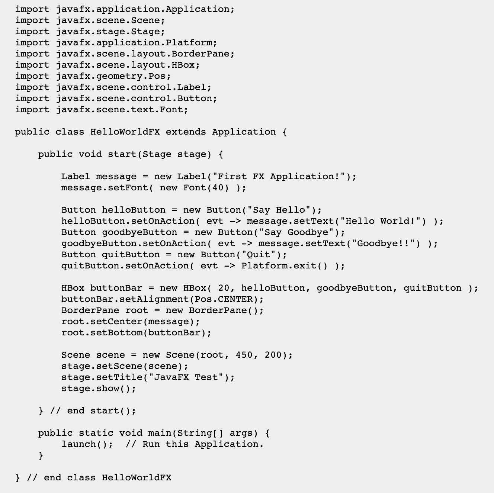
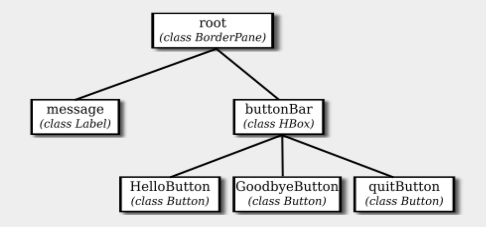

# Week 6 : GUI

|Section List|
|------------|
|[Section 6.1 (A Basic JavaFX Application)](#section-61-a-basic-javafx-application)|
|[Discussion Assignment](#discussion-assignment)|

## Reading

- Chapter 1, Section 6: The Modern User Interface
- Chapter 6: Introduction to GUI Programming, Sections 1, 2, 3, and 6.

## Optional Reading

- Chapter 3, Section 9: Introduction to GUI Programming
- Chapter 6, Section 4: Basic Controls
- Chapter 6, Section 5: Basic Layouts

### Section 6.1 (A Basic JavaFX Application)

- It was only in the mid 1980s that home computers with graphical user interfaces started to become available.
  - Today, most people interact with their computers exclusively through a GUI. A GUI program offers a much richer type of user interface, where the user uses a mouse and keyboard (or other input devices) to interact with GUI components such as windows, menus, buttons, check boxes, text input boxes, scroll bars, and so on.




### Discussion Assignment

```Text
Considering the Java program in section 6.3.3 “Dragging” of Eck (2019), describe what it does in response to specific operations of the mouse (mousePressed, mouseDragged, and mouseReleased), and how it does it. 

You are encouraged to run the SimplePaint program for yourself to test its behavior. Then read through the program carefully to understand how that behavior arises.

Your Discussion should be at least 250 words in length, but not more than 750 words. Once you’ve completed your initial post, be sure to respond to the posts of at least 3 of your classmates.
```

mousePressed(), mouseDragged() and mouseReleased() are mouse related methods, which notifies user action to the programme. These methods are part of the MouseListnener interface (Java.awt.event.MouseLisetener) or MouseMotionListener(Java.awt.event.MouseMotionListener), which generally covers mouse events for onscreen area. Methods can get triggered by clicks and also movement of the cursor within the onscreen area. We can also trigger methods when the cursor leaves a specific area.

mousePressed():
The mousePressed() method in Java can handle or respond to users mouse click event in the graphical interface (GUI). the method is valid within the component that the MouseListener is attached. The method takes "MouseEvent e" parameter, which contains information such as the x and y coordinates of the mouse when the method was triggered , as well as what form of mouse was clicked.

One point to note: there is a similar method called mouseClicked(). mousePressed and mouseClicked however are different methods and use case. mousePressed() is called after the user presses a mouse while mouseClicked() is called when the user press and release the mouse.

mouseDragged():
The mouseDragged() method is part of MouseMotionListener which gets invoked when the botton is pressed (meaning not released) on a component and then been dragged to a different location. The event MOUSE_DRAGGED will be delivered to the component from where the drag started until the button is released.

mouseReleased():
mouseReleased() method is part of MouseListener interface
which gets invoked when the mouse button has been released. 

Reference
Interface MouseListener. MouseListener (Java Platform SE 8 ). (2023, January 9). Retrieved March 7, 2023, from https://docs.oracle.com/javase/8/docs/api/java/awt/event/MouseListener.html#mouseReleased-java.awt.event.MouseEvent- 

Interface MouseMotionListener. MouseMotionListener (Java SE 10 &amp; JDK 10 ). (n.d.). Retrieved March 7, 2023, from https://docs.oracle.com/javase/10/docs/api/java/awt/event/MouseMotionListener.html#mouseDragged-java.awt.event.MouseEvent- 